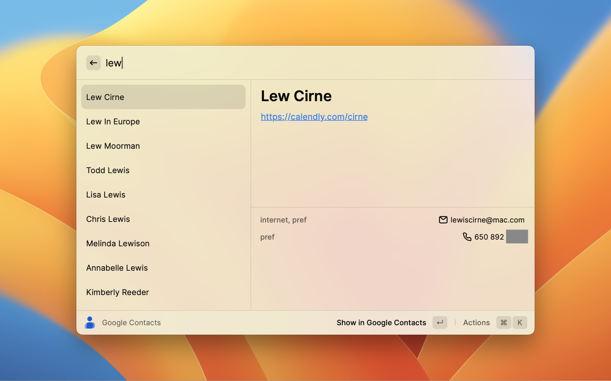

# Contacts

Search your Google contacts in Raycast

Press enter to jump to the selected contact in google contacts, or you can 
select any email address or phone number and copy it to your clipboard.

This project is still under development. When it is ready to publish,
I will apply to google to get the Oauth client ID approved.

Until then, if you'd like to be an early tester/contributor,
email me at lewiscirne@mac.com and I'll add you to the list
of authorized test users for this oauth client.

## Testing and Contributing
Since this extension isn't published yet, you will need to run it in development 
mode locally. Follow these instructions:

1. Be sure you have the [system requirements](https://developers.raycast.com/basics/getting-started) 
installed.
2. Clone this repo: `git clone https://github.com/cirne/raycast-contacts.git`
3. Install dependencies: `npm install`
4. Run the extension: `npm run dev`

If you want to make contributions, feel free to open a PR!

## License
This project is licensed under the terms of the MIT license.

d